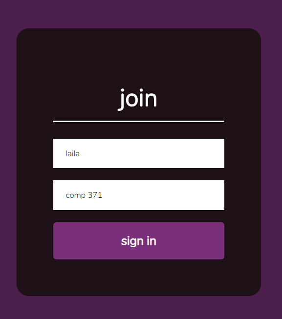

try it out:

## https://laila-chat-app.netlify.app/

## Realtime Chat App

A chat app that allows users to enter rooms. A simple and seamless way for people to chat.

### Getting Started

These instructions will get you a copy of the project up and running on your local machine for development and testing purposes. See deployment for notes on how to deploy the project on a live system.

### Demo

      

### Deployment

Deployed the client side on Netlify, and the server side on Heroku.

### Built With

* front-end: react.js, socket.io-client, react-scroll-to-bottom, react-emoji, query-string

* backend: node.js, socket.io, cors, express

### In the future:
Might work on a light mode, dark mode, and adding some tests with jest.
