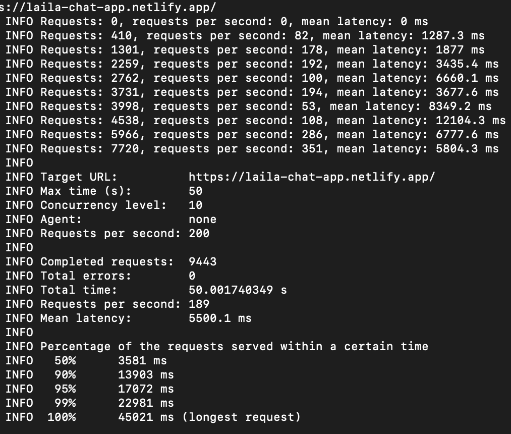

try it out:

## https://laila-chat-app.netlify.app/

## Realtime Chat App

A chat app that allows users to enter rooms. A simple and seamless way for people to chat.

### Built With

* front-end: react.js, socket.io-client, react-scroll-to-bottom, react-emoji, query-string

* backend: node.js, socket.io, cors, express

### Notes:

used socket.io for realtime data transfer

features: emojis get read as emojis, scrolling, button to go down to the most recent message

new: added unit, integration and end-to-end tests with jest and puppeteer!

new: used github actions to automate build, and to test before integrating changes

new: made an desktop ver using electron https://github.com/laila-chammaa/electron-chat-app

larger scale project with 7 components, each with css file, used modern project structure

used state hooks and props for data flow

read up extensively on socket.io documentation.

### Deployment

Deployed the client side on Netlify, and the server side on Heroku.

### Load tests
Used [loadtest](https://www.npmjs.com/package/loadtest), an npm package

### Demo

      

### In the future:
Might work on a light and dark mode.
